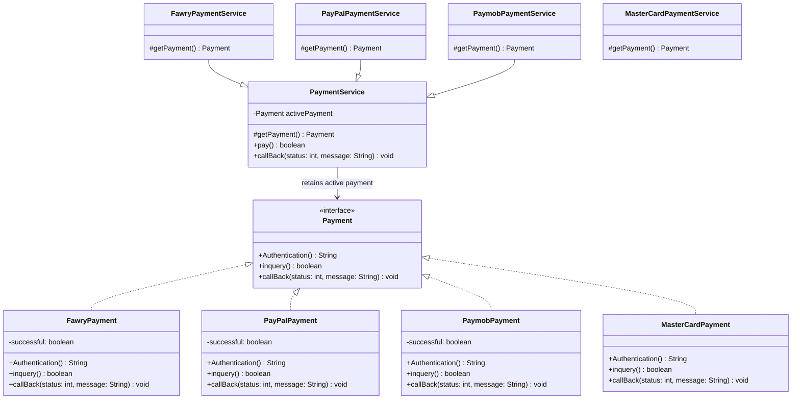

# Payment system UML

The diagram reflects the current implementation. It uses the Factory Method pattern: each concrete payment service creates one `Payment` implementation.

```mermaid
classDiagram
    `class AbstractFactoryMethodDesignPattern {
        +main(String[] args) void
    }`

    class PaymentService {
        -Payment activePayment
        #getPayment() Payment
        +pay() boolean
        +callBack(status: int, message: String) void
    }

    class Payment {
        <<interface>>
        +Authentication() String
        +inquery() boolean
        +callBack(status: int, message: String) void
    }

    class FawryPaymentService {
        #getPayment() Payment
    }
    class PayPalPaymentService {
        #getPayment() Payment
    }
    class PaymobPaymentService {
        #getPayment() Payment
    }
     class MasterCardPaymentService {
        #getPayment() Payment
    }

    class FawryPayment {
        -successful: boolean
        +Authentication() String
        +inquery() boolean
        +callBack(status: int, message: String) void
    }
    class PayPalPayment {
        -successful: boolean
        +Authentication() String
        +inquery() boolean
        +callBack(status: int, message: String) void
    }
    class PaymobPayment {
        -successful: boolean
        +Authentication() String
        +inquery() boolean
        +callBack(status: int, message: String) void
    }
    class MasterCardPayment {
        +Authentication() String
        +inquery() boolean
        +callBack(status: int, message: String) void
    }

   ` AbstractFactoryMethodDesignPattern ..> PaymentService : uses`
    FawryPaymentService --|> PaymentService
    PayPalPaymentService --|> PaymentService
    PaymobPaymentService --|> PaymentService

    PaymentService --> Payment : retains active payment
    Payment <|.. FawryPayment
    Payment <|.. PayPalPayment
    Payment <|.. PaymobPayment
    Payment <|.. MasterCardPayment

   ` FawryPaymentService ..> FawryPayment : creates
    PayPalPaymentService ..> PayPalPayment : creates
    PaymobPaymentService ..> PaymobPayment : creates`
```
