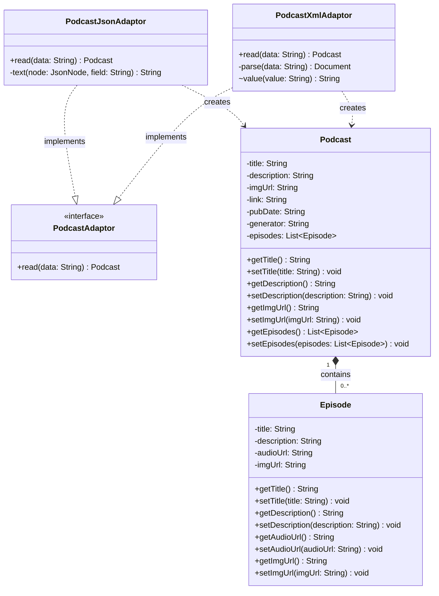

# Project UML class diagram

```mermaid
classDiagram
    class PodcastAdaptor {
        <<interface>>
        +read(data: String) Podcast
    }

    class PodcastJsonAdaptor {
        +read(data: String) Podcast
        -text(node: JsonNode, field: String) String
    }

    class PodcastXmlAdaptor {
        +read(data: String) Podcast
        -parse(data: String) Document
        ~value(value: String) String
    }

   ` class AdaptorApplication {
        +main(args: String[]) void
        +jsonApi() void
        +xmlApi() void
    }`

    class Podcast {
        -title: String
        -description: String
        -imgUrl: String
        -link: String
        -pubDate: String
        -generator: String
        -episodes: List~Episode~
        +getTitle() String
        +setTitle(title: String) void
        +getDescription() String
        +setDescription(description: String) void
        +getImgUrl() String
        +setImgUrl(imgUrl: String) void
        +getEpisodes() List~Episode~
        +setEpisodes(episodes: List~Episode~) void
    }

    class Episode {
        -title: String
        -description: String
        -audioUrl: String
        -imgUrl: String
        +getTitle() String
        +setTitle(title: String) void
        +getDescription() String
        +setDescription(description: String) void
        +getAudioUrl() String
        +setAudioUrl(audioUrl: String) void
        +getImgUrl() String
        +setImgUrl(imgUrl: String) void
    }

    PodcastJsonAdaptor ..|> PodcastAdaptor : implements
    PodcastXmlAdaptor ..|> PodcastAdaptor : implements
    Podcast "1" *-- "0..*" Episode : contains
    `AdaptorApplication ..> PodcastAdaptor : uses`
   ` AdaptorApplication ..> PodcastJsonAdaptor : creates`
    `AdaptorApplication ..> PodcastXmlAdaptor : creates`
    PodcastJsonAdaptor ..> Podcast : creates
    PodcastXmlAdaptor ..> Podcast : creates
```
